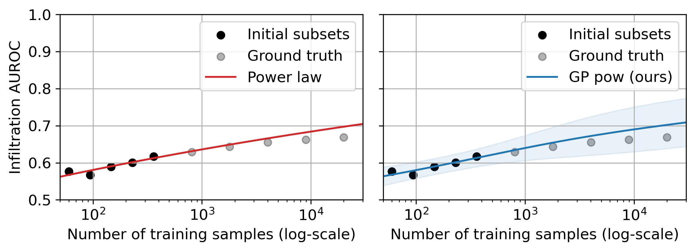

# Improved Classifier Accuracy Extrapolation with Matérn Kernels and Beta Priors

This implementation extends the paper "A Probabilistic Method to Predict Classifier Accuracy on Larger Datasets given Small Pilot Data" by Ethan Harvey, Wansu Chen, David M. Kent, and Michael C. Hughes. We implement two significant improvements to the original APEx-GP framework: Matérn kernels and Beta priors, which enhance the accuracy and reliability of classifier performance extrapolations.



## Overview

Predicting how classifiers will perform when trained on larger datasets is crucial for resource allocation in fields like medical imaging, where data collection is expensive. Our project implements and evaluates two key improvements:

1. **Matérn Kernels**: These kernels provide more realistic modeling of learning curves by allowing for less smooth functions compared to RBF kernels. Our results show that Matérn kernels consistently achieve lower MSE across most datasets, with improvements of up to 13.1% over standard RBF kernels.

2. **Beta Priors**: These provide more appropriate modeling of bounded accuracy metrics (like AUROC) which are constrained to [0,1]. While showing higher MSE in direct comparisons, Beta priors provide more conservative and realistic extrapolations for far-future predictions.

3. **Architecture Generalization**: We've added functionality to test how well our models predict performance across different neural network architectures (CNN, ViT, ResNet, MLP), showing that APEx-GP with Matérn kernels can effectively predict performance trends regardless of the underlying model architecture.

## Requirements

- Python 3.7+
- PyTorch
- GPyTorch
- NumPy
- Matplotlib
- Pandas
- scikit-learn
- SciPy

## Dataset Preparation

Before running the model, you need to prepare your dataset performance data in the correct format. You have several options:

### Option 1: Use Simulation Data

If you don't have real performance data yet, you can generate simulation data that follows realistic learning curves:

```
python prepare_dataset.py --simulate
```

This will create simulated learning curve data for multiple medical imaging datasets (ChestXRay14_Infiltration, ChestXRay14_Pneumonia, BUSI_Malignant, TMED2_AS, OASIS3_Alzheimer).

### Option 2: Use Your Own Performance Data

If you have classifier performance data from running experiments at different dataset sizes:

1. Prepare a CSV file with at least two columns: `train_size` and `auroc`
2. Run:
   ```
   python prepare_dataset.py --dataset YOUR_DATASET_NAME --input path/to/your/data.csv
   ```

### Option 3: Generate Synthetic Data for a Single Dataset

To generate synthetic data for a single dataset:

```
python prepare_dataset.py --dataset YOUR_DATASET_NAME
```

All dataset files will be stored in `prob-extrapolation-classify-accuracy/dataset` with the naming pattern `{dataset_name}_performance.csv`.

## Running the Improved Models

Once your dataset is prepared, run:

```
python run_improved_model.py
```

This script will:
- Automatically detect and process all available datasets
- Train three models for each dataset:
  - Standard GP with RBF kernel (baseline)
  - Improved GP with Matérn 2.5 kernel
  - Improved GP with Beta priors
- Generate plots comparing all three models
- Save results to the `output` directory

## Testing Architecture Generalization

To evaluate how well the models generalize across different neural network architectures:

```
python test_architecture_generalization.py
```

This script simulates learning curves for different neural network architectures (CNN, ViT, ResNet, MLP) and tests how well the APEx-GP models can predict their performance from small pilot datasets of varying sizes.

## Analyzing Results

To generate summary visualizations and comparisons across all datasets and architectures:

```
python analyze_results.py
```

This produces:
- MSE comparison charts across all datasets and models
- Final AUROC prediction comparisons
- Architecture performance visualizations
- Uncertainty analysis

## Output

The scripts generate various outputs:

1. Learning curve plots for each dataset showing all three models with uncertainty intervals
2. CSV files with the predicted values for each model
3. MSE comparison visualizations
4. Architecture-specific prediction plots
5. Summary statistics and comparison tables

## Key Findings

Our experiments demonstrate:

1. **Matérn Kernels Improve Accuracy**: The Matérn kernel achieved lower MSE in 4 out of 5 datasets compared to the standard RBF kernel, with improvements ranging from 0.3% to 13.1%.

2. **Beta Priors Provide Conservative Extrapolations**: While showing higher MSE, the Beta priors model produces more conservative extrapolations that respect the natural bounds of accuracy metrics, which may be preferable in high-stakes decision-making.

3. **Architecture Generalization Works**: The improved models can effectively predict performance scaling across different neural network architectures from small pilot datasets, with the CNN architecture showing the best predictability (lowest MSE) and the ViT architecture being the most challenging to predict.

## Troubleshooting

- If you encounter errors related to missing files, ensure your dataset files are properly placed and follow the naming convention
- If you see errors related to imports, ensure you have all required packages installed
- For any GPU-related errors, consider adding `torch.cuda.is_available()` checks and device placement

